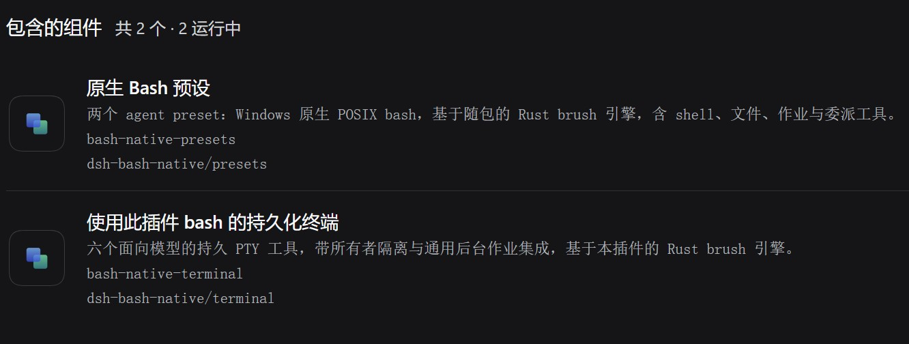

<!-- ═══════════════════════════════════════════════════════════════════════ -->

<div align="center">

# 🐚 dsh-bash-native

### A Windows-native POSIX bash executor, written in Rust

**A genuinely native `bash` for DSH's shell** — the brush engine, with no WSL and no MSYS compatibility layer

<br>

`Three-tier file policy` · `Background jobs` · `Persistent terminal`<sub>DSH ≥ 0.2.1-alpha.1</sub>

<br>

[](https://dsh-plugin.org/zh/plugins/spookywaste/dsh-bash-native)
[](https://github.com/SpookyWaste/dsh-bash-native/actions/workflows/ci.yml)
[](https://www.npmjs.com/package/dsh-bash-native)
[](https://github.com/deepseek-ai/deepseek-harness)
[](https://github.com/reubeno/brush)

[**中文**](README.md) &nbsp;·&nbsp; **English**

</div>

---

## 🐟 Why this exists

> ~~So the fat fish stops getting bitten by cmd~~, and to avoid the cost of a subsystem or an MSYS compatibility layer

<p align="center">
  
</p>

<table align="center">
  <thead>
    <tr>
      <th align="left">Approach</th>
      <th align="left">Where the command runs</th>
      <th align="left">What each command costs</th>
    </tr>
  </thead>
  <tbody>
    <tr>
      <td><b>Git for Windows</b></td>
      <td>A ported bash on the MSYS2 compatibility layer, with POSIX semantics emulated at runtime</td>
      <td>Every subshell or external command makes that layer fork a whole MSYS2 process (suspending threads, starting a process, moving memory through a pipe), so the cost grows linearly with how often subshells start</td>
    </tr>
    <tr>
      <td><b>WSL</b></td>
      <td>The command runs inside a distribution in a Linux VM</td>
      <td>Every command crosses the Windows/Linux boundary twice, which hurts short, frequent commands most</td>
    </tr>
    <tr>
      <td><b>This plugin</b><br><sub>brush engine + toolchain</sub></td>
      <td>A native binary written in Rust, with no emulation layer and no VM</td>
      <td><code>echo</code>, <code>cat</code>, <code>ls</code>, <code>cp</code> and friends are built into the engine and start no process at all; the rest start as native processes, with no compatibility layer and no VM boundary</td>
    </tr>
  </tbody>
</table>

---

## 📦 Install

### From the CLI

```
dsh plugin --profile web add dsh-bash-native
```

### From the dsh web or desktop app

> **dsh plugin page** → **Add plugin** in the top right → paste the plugin name `dsh-bash-native` or the repository URL:

```
https://github.com/SpookyWaste/dsh-bash-native
```

After restarting, set **Native Bash (Windows)** as the default preset under **Settings → General** (or switch to it inside a session).

> The persistent terminal component is **off by default**; switch it on in the plugin manager. See [the persistent terminal component](#the-persistent-terminal-component).

<table>
  <tbody>
    <tr>
      <td><b>Platform</b></td>
      <td>Windows x64</td>
    </tr>
    <tr>
      <td><b>Node</b></td>
      <td>24</td>
    </tr>
    <tr>
      <td><b>DSH</b></td>
      <td><code>&gt;=0.2.0-rc.2 &lt;0.3.0-0</code> (0.2.0-rc.2 and 0.2.1-alpha.2 both verified here)</td>
    </tr>
    <tr>
      <td><b>Persistent terminal component<sub>new in 0.1.6</sub></b></td>
      <td>Requires <code>&gt;=0.2.1-alpha.2</code></td>
    </tr>
  </tbody>
</table>

---

## ⚙️ Engine

The engine is **brush** (a bash-compatible shell written in Rust, MIT). This repository patches it and builds it from source, and the result — `engine/win32-x64/brush.exe`, about 15 MB — is committed with the package.

<details>
<summary><b>🧩 Patch list (click to expand)</b></summary>

<br>

<table>
  <thead>
    <tr>
      <th align="center">#</th>
      <th align="left">Patch</th>
      <th align="left">What it does</th>
    </tr>
  </thead>
  <tbody>
    <tr>
      <td align="center">01</td>
      <td><code>0001-background-job-pid</code></td>
      <td>A background job made of literal external commands is spawned and registered by the parent, so <code>$!</code> and <code>jobs -p</code> report a real PID.</td>
    </tr>
    <tr>
      <td align="center">02</td>
      <td><code>0002-unix-tmp-alias</code></td>
      <td><code>/tmp</code> becomes an alias wherever the shell resolves a path itself — redirections, <code>cd</code>, <code>test -f</code>, and the root of a glob expansion.</td>
    </tr>
    <tr>
      <td align="center">03</td>
      <td><code>0003-err-trap-scope</code></td>
      <td>The <code>ERR</code> trap fires in the scope that set it, rather than being decided by <code>set -E</code>.</td>
    </tr>
    <tr>
      <td align="center">04</td>
      <td><code>0004-external-argv-tmp-alias</code></td>
      <td>The alias rewrite reaches the <b>arguments</b> of every command the shell starts, and leaves <code>DSH_BASH_NATIVE_NO_PATHCONV=1</code> as the escape hatch.</td>
    </tr>
    <tr>
      <td align="center">05</td>
      <td><code>0005-closed-reader-stage-abort</code></td>
      <td>When the reader has already left, a broken-pipe compound command aborts as a whole instead of continuing silently the way upstream does.</td>
    </tr>
    <tr>
      <td align="center">06</td>
      <td><code>0006-descriptor-paths</code></td>
      <td><code>/dev/fd/N</code>, <code>/dev/stdin</code>, <code>/dev/stdout</code> and <code>/dev/stderr</code> resolve against the <b>shell's own</b> descriptor table.</td>
    </tr>
    <tr>
      <td align="center">07</td>
      <td><code>0007-wait-selectors</code></td>
      <td><code>wait</code> reports the status of the job it waited for, instead of only supporting “wait for all” and <code>%spec</code>.</td>
    </tr>
    <tr>
      <td align="center">08</td>
      <td><code>0008-windows-kill-builtin</code></td>
      <td><code>kill</code> becomes a builtin with job specs and a signal vocabulary, and a killed child reports 128+n.</td>
    </tr>
    <tr>
      <td align="center">09</td>
      <td><code>0009-drive-mount-aliases</code></td>
      <td>A first component that is a single letter resolves as a drive mount, so <code>/c/Windows/System32</code> is <code>C:\Windows\System32</code>.</td>
    </tr>
    <tr>
      <td align="center">10</td>
      <td><code>0010-missing-builtins</code></td>
      <td>Adds the builtins a script reaches for (<code>umask</code>, <code>history</code>, <code>disown</code>, <code>wait -f</code> and others), each with a meaning it can defend.</td>
    </tr>
    <tr>
      <td align="center">11</td>
      <td><code>0011-crlf-script-text</code></td>
      <td>A script written on Windows is read as text, so a trailing CR no longer enters the grammar.</td>
    </tr>
    <tr>
      <td align="center">12</td>
      <td><code>0012-relative-command-paths</code></td>
      <td>A command given as a relative path resolves against the shell's working directory, which is what makes <code>./sub/x.exe</code> run.</td>
    </tr>
    <tr>
      <td align="center">13</td>
      <td><code>0013-compound-pipeline-stage-concurrency</code></td>
      <td>An in-process stage that is not the last one moves onto its own thread, so a pipeline like <code>{ cat big.txt; } | head -1</code> no longer deadlocks once its output exceeds the pipe buffer.</td>
    </tr>
    <tr>
      <td align="center">14</td>
      <td><code>0014-function-call-stage-concurrency</code></td>
      <td>The same rule covers the case where the stage is a function call (<code>f() { cat big.txt; }; f | head -1</code>).</td>
    </tr>
    <tr>
      <td align="center">15</td>
      <td><code>0015-trailing-slash-requires-directory</code> <sub>0.1.1</sub></td>
      <td>A trailing separator matches directories only; <code>*/</code> and <code>*.md/</code> stop being answered by the volume's leniency.</td>
    </tr>
    <tr>
      <td align="center">16</td>
      <td><code>0016-bundled-name-dispatch</code> <sub>0.1.1</sub></td>
      <td>The engine dispatches on its own file name to a bundled utility (<code>rm.exe</code> is <code>rm</code>), and rewrites <code>/tmp</code> arguments along that path too.</td>
    </tr>
    <tr>
      <td align="center">17</td>
      <td><code>0017-rm-refuses-a-trailing-separator-on-a-file</code> <sub>0.1.1</sub></td>
      <td><code>rm</code> refuses “a trailing separator that points at a non-directory” instead of silently deleting that regular file.</td>
    </tr>
    <tr>
      <td align="center">18</td>
      <td><code>0018-host-env-survives-non-unicode</code> <sub>new in 0.1.3</sub></td>
      <td>One undecodable variable in the host environment no longer crashes the engine at startup — <code>--version</code> still exited 0, so it passed verification and then aborted every command while the shell was being built.</td>
    </tr>
    <tr>
      <td align="center">19</td>
      <td><code>0019-windows-long-path-identity</code> <sub>new in 0.1.3</sub></td>
      <td>One directory keeps one spelling (the long one). <code>$PWD</code>, <code>$TEMP</code>/<code>$TMPDIR</code> and <code>/tmp</code> give the same string when they name the same place, with no <code>EXAMPL~1</code>-style 8.3 short name left over.</td>
    </tr>
    <tr>
      <td align="center">20</td>
      <td><code>0020-windows-file-identity</code> <sub>new in 0.1.3</sub></td>
      <td><code>test -ef</code> compares real file identity (volume serial number + file index) instead of reporting <code>not supported on this platform</code>; hard links and directories both work.</td>
    </tr>
  </tbody>
</table>

</details>

> 💡 Every resolution verifies the artifact against the **sha256** in the lock, and skips the repeat check by **stamping**: the artifact's size and mtime go into `%LOCALAPPDATA%\dsh-bash-native\verified\`, and an unchanged stamp means those 15.6 MB are never read again (`verifyArtifacts: 'always'` restores hashing every time).

---

## 🔧 How it is built

- **Registers `ctx.shell`**: a Service Provider for `ShellExecutor`, built on `@deepseek-ai/dsh-bash-local`, handing each command to the brush engine it resolved; **both the engine and the toolchain ship with the package** and are verified against the lock and the manifest when they are resolved.
- **Obeys DSH's three-tier file policy** (`read-only` / `workspace-write` / `danger-full-access`): a confined tier hands the engine argv to `ctx.sandbox`, an unconfined one spawns directly and reports the tier it actually got.
- **Background jobs are reported through `ctx.jobs`**, and output past the in-memory bound lands in a spill file whose path comes back with the result; `echo`, `cat`, `ls`, `cp`, `rm`, `sort` and friends come from the engine and resolve as builtins, so an empty `PATH` still works.
- **The web side** mounts it with its own agent preset and **the agent side** enables it with an overlay; it does not replace the host's `ctx.shell`, so another preset's `pwsh` tools are unaffected.

---

## 🎛 The two presets

[`cordis.patch.yml`](cordis.patch.yml) carries **one registration row** (`dsh-bash-native/presets`); the plugin registers both presets at run time (`ctx.agentPresets.register()`) from the row data in [`src/preset-data.ts`](src/preset-data.ts), and each preset still owns an `isolate: { shell: true, terminals: true }` realm so that the host layer and every other preset (including the ones using `pwsh`) are left completely untouched.

Per-host probing<sub>new in 0.1.5</sub>: a package this harness cannot provide keeps its row out of the preset, while a harness line that does provide it loads the row as usual. (The `tool-schedule` row 0.2.1-alpha added, for instance, appears only in that line's preset — never in 0.2.0-rc.2's.)

<table>
  <thead>
    <tr>
      <th align="left">Preset</th>
      <th align="left">What it mounts</th>
      <th align="left">When to pick it</th>
    </tr>
  </thead>
  <tbody>
    <tr>
      <td><b>Native Bash (Windows)</b><br><sub>id <code>bash-native</code>, order 5</sub></td>
      <td>Mirrors the harness's <code>standard</code> plus the shell group: a <code>bash</code> that runs every call in a fresh shell, <del>switchable to a persistent bash</del><sub>no longer offered in 0.1.5, matching the shipped standard preset</sub>, and the full set of file, job and delegation tools, plus<sub>new in 0.1.6</sub> the six interactive terminal tools</td>
      <td>Everyday use</td>
    </tr>
    <tr>
      <td><b>Native Bash (Windows, minimal)</b><br><sub>id <code>bash-native-minimal</code>, order 6</sub></td>
      <td>Mirrors the harness's <code>minimal</code>: one persona and one persistent bash, with no file, job or delegation tools, and deliberately no interactive terminal</td>
      <td>A lightweight session that only wants a shell</td>
    </tr>
  </tbody>
</table>

## 📟 The persistent terminal component

On the Plugins page, `dsh-bash-native` offers **two separately switchable components**: `dsh-bash-native/presets` (the two presets, on by default) and `dsh-bash-native/terminal` (six interactive persistent terminal tools, off by default).

<p align="center">
  
</p>

That component registers the same tool names as the built-in **Persistent terminals** (`@deepseek-ai/dsh-experimental-terminal-bundle`), so the two cannot be on at once. (`tool "terminal_open" is already registered`)

---

## 🛠 Configuration

> Beyond the table below, the execution budget is inherited from `@deepseek-ai/dsh-bash-local`: `cwd`, `timeoutMs`, `maxTimeoutMs`, `maxOutputBytes`, `maxSpillBytes`, `graceMs`, whose defaults and caps have their single source in that side's schema.

<table>
  <thead>
    <tr>
      <th align="left">Key</th>
      <th align="left">Default</th>
      <th align="left">Meaning</th>
    </tr>
  </thead>
  <tbody>
    <tr>
      <td><code>confine</code></td>
      <td><code>true</code></td>
      <td>Whether to obey <code>ctx.sandbox</code>; turning it off gives up the file policy and the denial marking</td>
    </tr>
    <tr>
      <td><code>requireEngineOnLoad</code></td>
      <td><code>false</code></td>
      <td>Whether a missing engine fails the load or fails each call (both presets set <code>true</code>)</td>
    </tr>
    <tr>
      <td><code>promptSection</code></td>
      <td><code>true</code></td>
      <td>Whether to contribute the model-visible environment contract section</td>
    </tr>
    <tr>
      <td><code>promptDetail</code></td>
      <td><code>full</code></td>
      <td>A compatibility key that is kept: now that the contract is two sentences, both values produce the same text, so setting it or not makes no difference</td>
    </tr>
    <tr>
      <td><code>toolsDir</code></td>
      <td><code>''</code></td>
      <td>The POSIX toolchain directory; empty = look first at the one built under the per-user directory (<code>%LOCALAPPDATA%\dsh-bash-native\tools\bin</code>), and fall back to the bundled toolchain when it provides no program. A value is used as given, and an empty directory counts as one (it is never quietly swapped for the bundled copy)</td>
    </tr>
    <tr>
      <td><code>bashPath</code></td>
      <td><code>''</code></td>
      <td>Absolute path to the engine; empty = search in resolution order</td>
    </tr>
    <tr>
      <td><code>bundledEngineDir</code></td>
      <td><code>''</code></td>
      <td>A bundled engine directory: <code>brush.exe</code> is probed first, then <code>bin/brush.exe</code></td>
    </tr>
    <tr>
      <td><code>rcFile</code></td>
      <td><code>''</code></td>
      <td>The startup file a persistent PTY session reads; empty = <code>%LOCALAPPDATA%\dsh-bash-native\bash-native-rc.sh</code></td>
    </tr>
    <tr>
      <td><code>denialSignatureAdditions</code></td>
      <td><code>['os error 5']</code></td>
      <td>Extra denial signatures; the default is what lets a non-English Windows still be marked as a denial</td>
    </tr>
    <tr>
      <td><code>shellEnvOverrides</code></td>
      <td><code>{}</code></td>
      <td>Extra environment variables, layered on top of the model-friendly defaults</td>
    </tr>
    <tr>
      <td><code>verifyArtifacts</code></td>
      <td><code>'stamped'</code></td>
      <td>How hard to verify: <code>stamped</code> rehashes only when the artifact or the running copy changes size or mtime; <code>always</code> hashes on every resolution (engine 31 MB, toolchain 76 MB)</td>
    </tr>
  </tbody>
</table>

---

## 🧰 Toolchain

**The toolchain ships with the package and works as installed.**

<details open>
<summary><b>📚 28 names, 20 of them published</b></summary>

<br>

| Category | Contents |
|---|---|
| **Published** (20) | `grep`, `sed`<sub>synced with upstream in 0.1.5</sub>, `awk`, `jq`, `find`, `xargs`, `diff`, `cmp`, `which`, `timeout`, `stat`, `ps`, and `tty`, `nohup`, `nice`, `uptime`, `hostid`, `pathchk`, `locate`, `updatedb` |
| **Installed but unpublished** (8) | `arch` plus the shell builtins `echo`, `printf`, `pwd`, `test`, `true`, `false`, `kill` — kept as the program form a child process needs |

</details>

<br>

- **Shadows the Windows programs of the same name whose semantics are unrelated**: `find.exe`, `timeout.exe` and the like. But there is **no** `convert.exe` in the toolchain, so that name still reaches Windows' volume-conversion tool — **do not use it as ImageMagick**.
- **Supports the same `/tmp` and drive aliases as the engine** (`$TMP` is still the recommendation), and a program starting another program stays on that path: `printf '/tmp/f\n' | xargs awk '{print}'`. The names the engine carries are rewritten on this path too (patch `0016`), so `printf '/tmp/x\n' | xargs rm` receives the real temporary path rather than the literal.
- **It also puts `bash`, `sh` and the engine's 75 utility names on `PATH`** (the toolchain directory first, the **name directory** immediately after it, both ahead of the host's own `PATH`):

  > `src/shim.ts` points those 77 names at the verified engine inside `%LOCALAPPDATA%\dsh-bash-native\shim\<engine sha256>\` — on one volume they are all **hard links**, so 77 names share the engine's single copy of the bytes — and the engine then dispatches on its own file name to the bundled implementation (patch `0016`). A child process cannot exec a shell builtin, so `xargs rm` and `find . -exec rm {} +` have to find a program by name, and the toolchain no longer publishes those 75 names a second time (the old layout's 103 names are down to 28).

  That is what makes `bash script.sh`, `bash -c …`, `sh -c …` and a Makefile or npm hook that calls `bash` work; **running a script by its own path does not work yet** (`./s.sh`).

---

## ⚠️ Known limitations

- **brush is still in preview on Windows**, so defects are possible.
- When the shell registers no process for a background job, test liveness with `wait` rather than `kill -0`.
- **`jobs` / `jobs -p` see an empty table inside a command substitution**; `kill` takes one target at a time (`kill %1 %2` reports 2); Windows delivers no signals, so any signal ends as **128+n** (TERM 143, KILL 137).
- **When the reader closes early (a broken pipe)**, a bundled utility or an external program uses its own wording and its own exit code:

  | Command | Writer exit code | Note |
  |---|:---:|---|
  | `seq 1 200000 \| head -c 1` | `0` | stderr says `write error: Broken pipe` |
  | `yes \| head -c 1` | `0` | says nothing |
  | `cat big \| head -c 1` | `13` | — |
  | `ls -R some-dir \| head -c 1` | `1` | — |
  | The engine's own builtins | `141` | ends correctly |

  This is what having no `SIGPIPE` on Windows costs (each utility decides for itself what to do about a broken pipe), so **do not judge a writer by `PIPESTATUS[0]` alone**.
- **The drive rewrite cannot tell a path from a program's script operand**: `awk '/x/{print}'` arrives as `X:\{print}` and `sed '/x/d'` reports `invalid command code`; write `awk '$0 ~ /x/'`, or set `DSH_BASH_NATIVE_NO_PATHCONV=1` for that one command.
- **The alias rewrite reads text, not intent**: a **data** argument that starts with `/tmp` is rewritten too (`grep /tmp/x file` goes looking for a temporary path); the escape hatch is again `DSH_BASH_NATIVE_NO_PATHCONV=1`, and with it every argument is passed through verbatim.
- **`select` is not supported yet** — a whole command containing one fails at **parse time**.
- **There is no `exec` and no `ulimit`**: the first needs to replace the process image, and the second's resource table is typed on `rlimit::Resource`, a crate that does not exist on Windows at all, so it could only report a few compatibility numbers with nothing behind them.

---

## 📄 License

| What | License | Notice and scan |
|---|:---:|---|
| This plugin | **MIT** | [LICENSE](LICENSE) |
| brush engine | **MIT** | [engine/LICENSE.brush](engine/LICENSE.brush), dependency scan [engine/THIRD-PARTY.md](engine/THIRD-PARTY.md) |
| Bundled toolchain | **MIT** | uutils `coreutils`/`findutils`/`grep`/`sed`, `jaq`, `goawk`, and this repository's `posix-extra`; [toolchain/LICENSES/](toolchain/LICENSES/) and [toolchain/THIRD-PARTY.md](toolchain/THIRD-PARTY.md) |

---

## 🙏 References and thanks

A number of the defects behind this plugin's engine patches were first diagnosed and fixed by **[oh-my-pi](https://github.com/can1357/oh-my-pi)**.
It is background inspiration, and the earlier implementation of the native-bash-on-Windows approach.

oh-my-pi is MIT licensed, and its notice ships with the engine artifact in [`engine/THIRD-PARTY.md`](engine/THIRD-PARTY.md).

<!-- ═══════════════════════════════════════════════════════════════════════ -->
